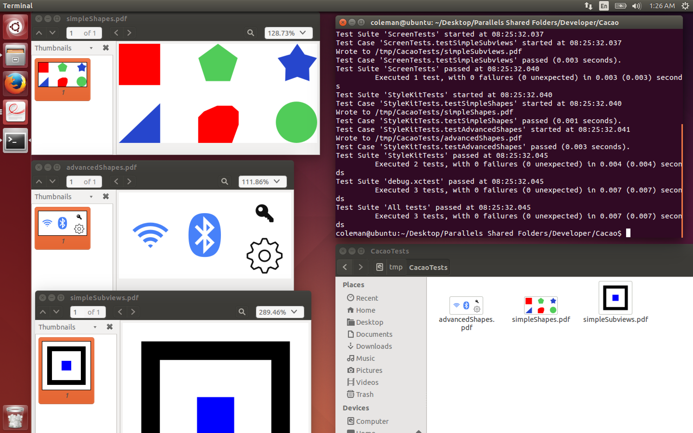
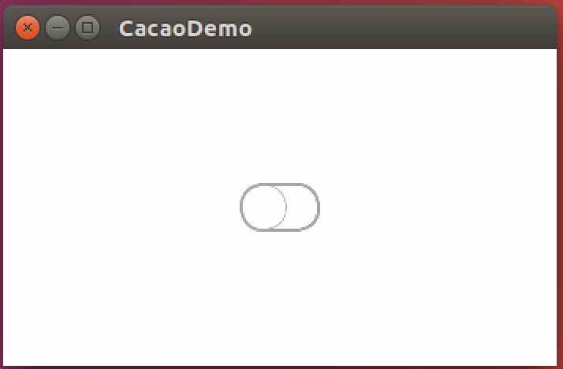
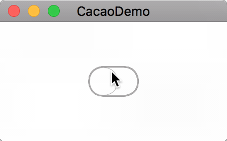
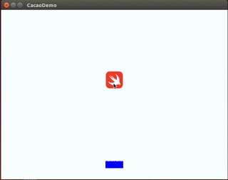
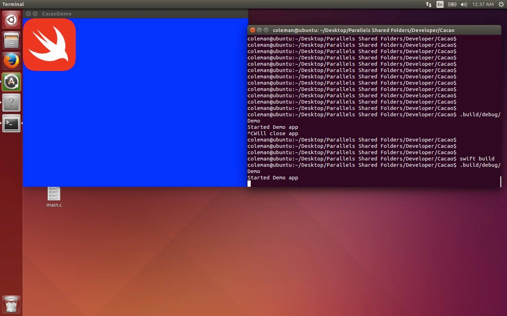

# Cacao
[](https://developer.apple.com/swift/)
[](https://developer.apple.com/swift/)
[](https://github.com/PureSwift/Cacao/releases)
[](https://tldrlegal.com/license/mit-license)
[](https://github.com/apple/swift-package-manager)

Pure Swift Cross-platform UIKit (Cocoa Touch) implementation (Supports Linux)

## Build

### OS X
```
brew install cairo sdl2 lcms2
swift build -Xlinker -L/usr/local/lib
```

### Ubuntu
```
sudo apt-get install libcairo-dev libsdl2-dev liblcms2-dev
swift build
```

## Screenshots

### Run [PaintCode](http://www.paintcodeapp.com) StyleKits in Linux



### Hardware-accelered `UIView` animations




### Layout views according to a `UIViewContentMode`



### Create applications that run in the native Window Manager




