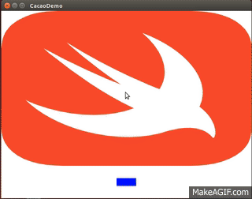
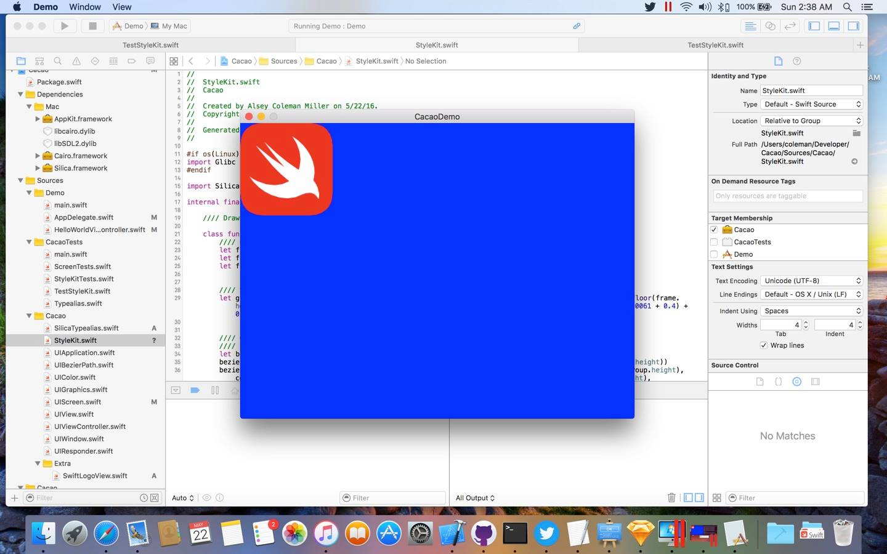

# Cacao
Pure Swift Cross-platform UIKit (Cocoa Touch) implementation (Supports Linux)

## Installation

### OS X
`brew install cairo sdl2`

### Ubuntu
`sudo apt-get install libcairo-dev libsdl2-dev`

## Screenshots

### Run [PaintCode](http://www.paintcodeapp.com) StyleKits in Linux

### Layout views according to a `UIViewContentMode`

### Create applications that run in the native Window Manager

